# PaperWriter

> **A thesis-draft pipeline that lives inside your terminal agent**: turn your assignment materials into a fully drafted thesis (.docx) with real citations, academic figures, and proper formatting.

English | [中文](./README.md)

**This is not another "AI writing web app."** It is a Skill installed into the terminal agent you already use (Claude Code / ZCode / Codex CLI, etc.). Say "写论文" ("write my thesis") and it proceeds like a real researcher would: search literature → write the review → build the outline → draft chapter by chapter → manage citations → self-check → deliver. For CS capstone projects it can even **build the actual working system first, then write the thesis from its real run results**.

## Two Workflows

### Workflow A: Writing-only thesis (humanities / social science / theory / survey)


### Workflow B: System-first (CS capstone / course project: thesis + working system)

```mermaid
flowchart LR
    S([Say: write my thesis]) --> I[Intake Q&A + confirmed brief]
    I --> L[Literature] --> R[Literature review]
    R ==> SY1[System planning<br/>minimal viable scope]
    SY1 ==> SY2[One-shot build & delivery<br/>one-click start / tests / real data export]
    SY2 ==> O[Thesis outline]
    O --> D[Cases & data<br/>real system data]
    D --> P[Writing plan] --> W[Chapter-by-chapter batches]
    W --> M[Merge + citations] --> Q[Quality] --> F[Figure factory]
    F ==> E([Thesis draft .docx<br/>+ system source code])
```



Workflow B's core rule, hardened by real practice: **every screenshot, test result, and performance number in the thesis must come from the actually-running system. No imagined results.** That is the fundamental difference from generic "AI paper generators."

## Scope

**✅ Good fits** — Chinese bachelor's theses, master's course papers, humanities/social-science case & survey papers, STEM theory/algorithm/simulation papers, **CS system-building capstones (system-first)**, course assignments (labs, review essays).

**❌ Out of scope / hard limits**

| Limit | Detail |
|---|---|
| No fabricated references, data, or results | Data gaps become drafts explicitly marked `[待核验]` (to verify), or the pipeline stops and asks |
| Does not replace real research | No experiments / fieldwork / clinical data collection; it only organizes data you already have |
| No plagiarism/AI-detector guarantees | Built-in anti-AI-tone writing rules reduce risk; outcomes vary by detector |
| Doctoral-level original theory | Can write to standard, but the novelty itself must come from the author |
| No LaTeX / journal-specific templates | Deliverable format is Word (.docx) |
| Delivers a **draft** | Author remains responsible for factual accuracy and academic integrity (see Disclaimer) |

## Quick Start (3 steps)

**1. Install (once)**

```bash
git clone https://github.com/<owner>/PaperWriter.git
cd PaperWriter
./install.sh          # auto-detects Claude Code / ZCode and installs the skill
pip install -r requirements.txt
```

**2. Configure (once, ~3 min)**

```bash
cp .env.example my-thesis/.env
# edit .env: SERPAPI_KEY (free signup at https://serpapi.com, 100 searches/month)
python3 skill/scripts/selfcheck.py   # must be all green
```

SERPAPI_KEY is **required**: even with your own reading list, the pipeline auto-tops-up when the list falls short.

**3. Run**

```bash
cd my-thesis
# drop the assignment brief / requirements / reading list into input/
claude                # or your terminal agent
```

```
> 写论文
```

Then it runs itself: brief confirmation (the **only** mandatory human checkpoint) → literature → review → outline → data → batch writing with per-batch verification → merge → citation alignment → length check → figures → Word draft → delivery summary (deliverables, word-count report, `[待核验]` items, polish advice).

Interrupted? Say "**继续**" (continue) and it resumes from the breakpoint. The pipeline only stops to ask you in three cases: **literature still insufficient after re-search, repeated batch failures, or the system cannot actually run.**

## What you provide

**Hard-required** (asked once, in a single batch): ① topic (no title yet? it proposes 3 candidates), ② total word count.
**Soft-required** (defaults applied and flagged if absent): instructor/school requirements — structure, approach, citation count & recency, format template.
**Optional:** reading list, school format template (.docx), data/survey/logs, benchmark paper.

## Repository layout

```
PaperWriter/
├── skill/                 ← the Skill itself (what gets installed)
│   ├── SKILL.md           master control: 5 phases + 13-step pipeline + gates
│   ├── references/        stage docs r00–r12 + writing rules
│   ├── scripts/           deterministic tools: search / batch guard / converters / figure engine / data gen
│   └── templates/         prompt / writing-plan / brief templates
├── examples/              two fictional sample packs (writing-only / system-first)
├── install.sh             installer
├── requirements.txt       Python dependencies
└── .env.example           env template (SERPAPI_KEY)
```

No install needed, alternative: clone the repo and point your agent at `skill/SKILL.md`.

## FAQ

- **Can I use it without a SerpAPI key?** The key is required (lists get topped up automatically). Free tier: 100 searches/month, enough for one thesis. Fully offline is not a supported default path.
- **Where does the data come from? Is it made up?** Three tiers: your real data first; real system exports for system-first projects; otherwise plausible drafts **explicitly marked `[待核验]`** and summarized in the delivery report. Never disguised as real.
- **Will it pass AI detection / plagiarism checks?** No promises — built-in anti-AI-tone rules reduce risk only.
- **English theses?** The main line targets Chinese theses (with EN/CN abstracts). EN translation & AI-rate reduction are on the roadmap (`skill/references/optional-extras.md`).

## Disclaimer

PaperWriter produces a **draft** and is positioned as an academic-writing workflow assistant. The user is responsible for factual accuracy, citation integrity, and compliance with their institution's academic-integrity policies.

## License

[MIT](./LICENSE)
